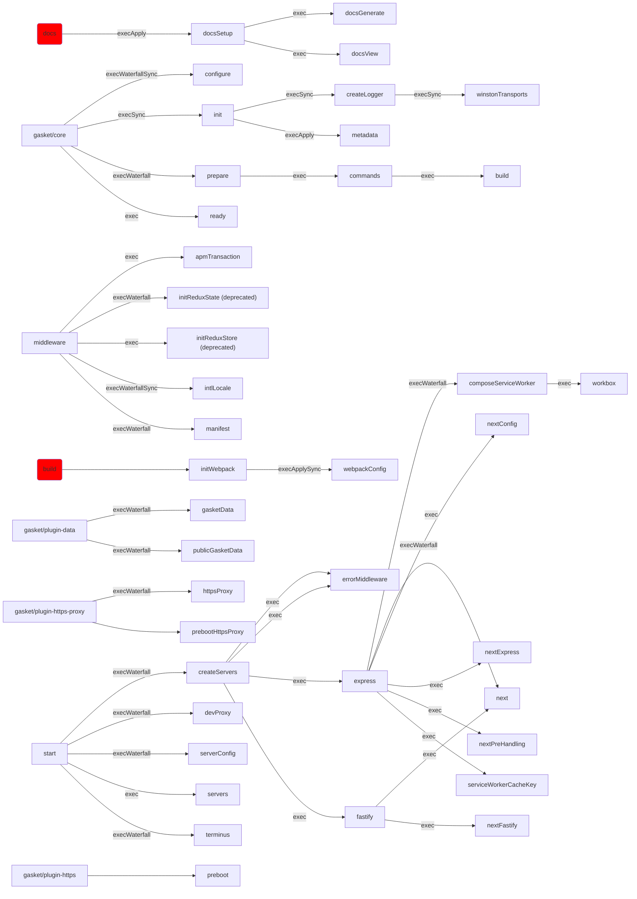

```mermaid
graph LR;
middleware -- exec --> apmTransaction;
commands -- exec --> build;
prepare -- exec --> commands;
express -- execWaterfall --> composeServiceWorker;
gasket/core -- execWaterfallSync --> configure;
init -- execSync --> createLogger;
start -- execWaterfall --> createServers;
start -- execWaterfall --> devProxy;
docsSetup -- exec --> docsGenerate;
docs-cmd(docs) -- execApply --> docsSetup;
docsSetup -- exec --> docsView;
createServers -- exec --> errorMiddleware;
createServers -- exec --> errorMiddleware;
createServers -- exec --> express;
createServers -- exec --> fastify;
gasket/plugin-data -- execWaterfall --> gasketData;
gasket/plugin-https-proxy -- execWaterfall --> httpsProxy;
gasket/core -- execSync --> init;
middleware -- execWaterfall --> initReduxState["initReduxState (deprecated)"];
middleware -- exec --> initReduxStore["initReduxStore (deprecated)"];
build-cmd(build) --> initWebpack;
middleware -- execWaterfallSync --> intlLocale;
middleware -- execWaterfall --> manifest;
init -- execApply --> metadata;
express -- exec --> next;
fastify -- exec --> next;
express -- execWaterfall --> nextConfig;
express -- exec --> nextExpress;
fastify -- exec --> nextFastify;
express -- exec --> nextPreHandling;
gasket/plugin-https --> preboot;
gasket/plugin-https-proxy --> prebootHttpsProxy;
gasket/core -- execWaterfall --> prepare;
gasket/plugin-data -- execWaterfall --> publicGasketData;
gasket/core -- exec --> ready;
start -- execWaterfall --> serverConfig;
start -- exec --> servers;
express -- exec --> serviceWorkerCacheKey;
start -- execWaterfall --> terminus;
initWebpack -- execApplySync --> webpackConfig;
createLogger -- execSync --> winstonTransports;
composeServiceWorker -- exec --> workbox;
style docs-cmd fill: red;
style build-cmd fill: red;
```