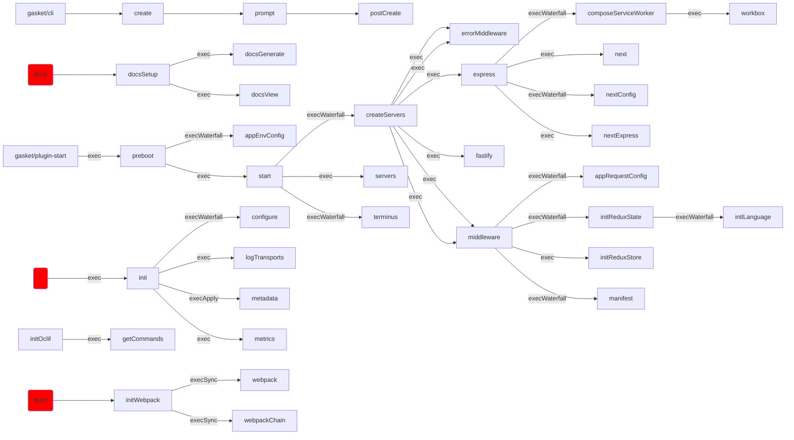

```mermaid
graph LR;
preboot -- execWaterfall --> appEnvConfig;
middleware -- execWaterfall --> appRequestConfig;
express -- execWaterfall --> composeServiceWorker;
init -- execWaterfall --> configure;
gasket/cli --> create;
start -- execWaterfall --> createServers;
docsSetup -- exec --> docsGenerate;
docs-cmd(docs) --> docsSetup;
docsSetup -- exec --> docsView;
createServers -- exec --> errorMiddleware;
createServers -- exec --> errorMiddleware;
createServers -- exec --> express;
createServers -- exec --> fastify;
initOclif -- exec --> getCommands;
*-cmd(*) -- exec --> init;
middleware -- execWaterfall --> initReduxState;
middleware -- exec --> initReduxStore;
build-cmd(build) --> initWebpack;
initReduxState -- execWaterfall --> intlLanguage;
init -- exec --> logTransports;
middleware -- execWaterfall --> manifest;
init -- execApply --> metadata;
init -- exec --> metrics;
createServers -- exec --> middleware;
createServers -- exec --> middleware;
express -- exec --> next;
express -- execWaterfall --> nextConfig;
express -- exec --> nextExpress;
prompt --> postCreate;
gasket/plugin-start -- exec --> preboot;
create --> prompt;
start -- exec --> servers;
preboot -- exec --> start;
start -- execWaterfall --> terminus;
initWebpack -- execSync --> webpack;
initWebpack -- execSync --> webpackChain;
composeServiceWorker -- exec --> workbox;
style docs-cmd fill: red;
style *-cmd fill: red;
style build-cmd fill: red;
```