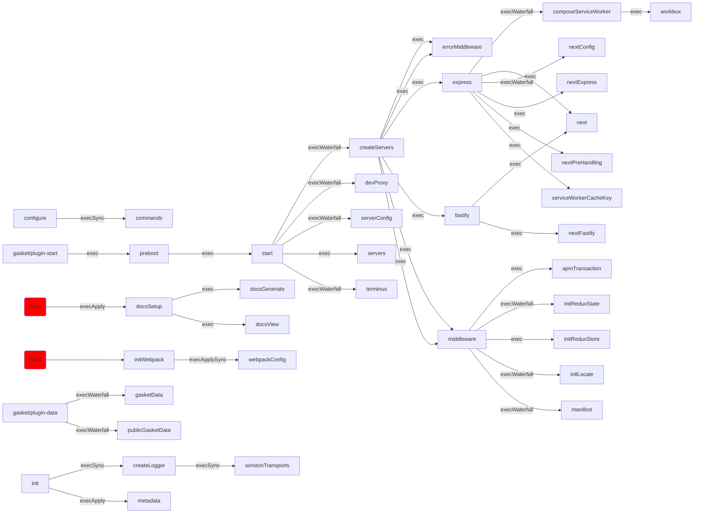

```mermaid
graph LR;
middleware -- exec --> apmTransaction;
configure -- execSync --> commands;
express -- execWaterfall --> composeServiceWorker;
init -- execSync --> createLogger;
start -- execWaterfall --> createServers;
start -- execWaterfall --> devProxy;
docsSetup -- exec --> docsGenerate;
docs-cmd(docs) -- execApply --> docsSetup;
docsSetup -- exec --> docsView;
createServers -- exec --> errorMiddleware;
createServers -- exec --> errorMiddleware;
createServers -- exec --> express;
createServers -- exec --> fastify;
gasket/plugin-data -- execWaterfall --> gasketData;
middleware -- execWaterfall --> initReduxState;
middleware -- exec --> initReduxStore;
build-cmd(build) --> initWebpack;
middleware -- execWaterfall --> intlLocale;
middleware -- execWaterfall --> manifest;
init -- execApply --> metadata;
createServers -- exec --> middleware;
createServers -- exec --> middleware;
express -- exec --> next;
fastify -- exec --> next;
express -- execWaterfall --> nextConfig;
express -- exec --> nextExpress;
fastify -- exec --> nextFastify;
express -- exec --> nextPreHandling;
gasket/plugin-start -- exec --> preboot;
gasket/plugin-data -- execWaterfall --> publicGasketData;
start -- execWaterfall --> serverConfig;
start -- exec --> servers;
express -- exec --> serviceWorkerCacheKey;
preboot -- exec --> start;
start -- execWaterfall --> terminus;
initWebpack -- execApplySync --> webpackConfig;
createLogger -- execSync --> winstonTransports;
composeServiceWorker -- exec --> workbox;
style docs-cmd fill: red;
style build-cmd fill: red;
```