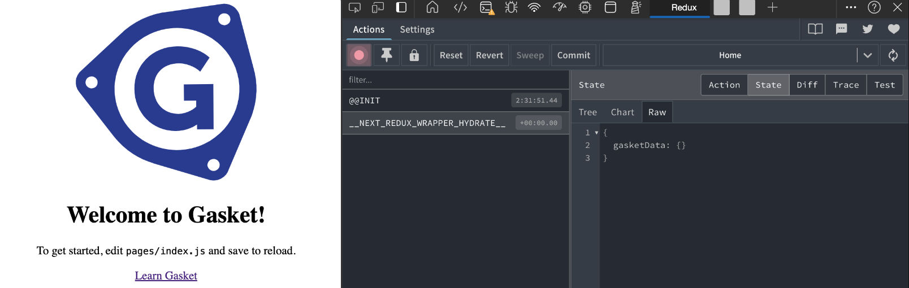

# Upgrade to v7 (Active)

This guide will take you through updating `@gasket/*` packages to `7.x`.

## Table of Contents

- [Update Dependency Versions](#update-dependency-versions)
- [Switch to makeGasket](#switch-to-makegasket)
  - [Switch to ESM (Optional)](#switch-to-esm-optional)
  - [Update Plugin Imports](#update-plugin-imports)
  - [Update Command Scripts](#update-command-scripts)
  - [Update Next.js Scripts](#update-nextjs-scripts)
- [Update Next.js](#update-nextjs)
- [Switch to GasketActions](#switch-to-gasketactions)
  - [Motivation](#motivation)
  - [Example](#example)
- [Update configurations](#update-configurations)
- [Switch to Docusaurus](#switch-to-docusaurus)
- [Update Lifecycles Contexts](#update-lifecycles-contexts)
- [Update ElasticAPM Start](#update-elasticapm-start)
- [Switch to GasketData](#switch-to-gasketdata)
- [Switch Redux to GasketData](#switch-redux-to-gasketdata)
  - [Initialize Redux with GasketData](#initialize-redux-with-gasketdata)  
- [Switch to @gasket/plugin-logger](#switch-to-gasketplugin-logger)
- [Update Intl](#update-intl)
  - [Bring your Own Intl Provider](#bring-your-own-intl-provider)
  - [Switch to Intl Manager](#switch-to-intl-manager)
  - [Move locale files (Optional)](#move-locale-files-optional)
- [Update Custom Commands](#update-custom-commands)
- [Update App Plugins](#update-app-plugins)
- [Update App Lifecycles](#update-app-lifecycles)
- [Update Mocha Tests](#update-mocha-tests)

## Update Dependency Versions

Update all `@gasket` scoped packages to the v7 major version.

This is not an exhaustive list, but rather a sampling of dependencies to
demonstrate what to look for:

```diff
"dependencies": {
-    "@gasket/fetch": "^6.0.2",
+    "@gasket/fetch": "^7.0.0",
-    "@gasket/data": "^6.5.0",
+    "@gasket/data": "^7.0.0",
-    "@gasket/plugin-workbox": "^6.4.1",
+    "@gasket/plugin-workbox": "^7.0.0",
}
```

## Switch to makeGasket

Gasket no longer comes with a CLI. Instead, you can use the `makeGasket`
function from `@gasket/core` to create a Gasket instance which can be used
throughout your app.

```diff
"dependencies": {
-    "@gasket/cli": "^6.0.2",
+    "@gasket/core": "^7.0.0",
}
```

Next you need to update your gasket.config.js file to use the `makeGasket`
function. We recommend renaming this file to `gasket.js` for clarity, since it's
more than just config.

### Switch to ESM (Optional)

Gasket works well with ESM if you're ready to make that move. Most of the
documentation will be in ESM format, but you can still choose to use CommonJS,
or TypeScript.

If you wish to make that move with this upgrade, you can set the `type` field in
your `package.json` to `module`.

```diff
{
+  "type": "module"
}
```

This will treat all your `.js` files as ESM files. If you are not ready, you can
keep your files defaulted as CommonJS, and switch individual files to ESM by
using the `.mjs` extension (i.e. `gasket.mjs`)

### Update Plugin Imports

Before, plugins were configured by their names as strings. Now, plugins should
be imported and configured in the `makeGasket` function.

```diff
// gasket.config.js
- module.exports = {
-   plugins: {
-     presets: [
-       '@gasket/plugin-nextjs',
-     ],
-   },
- };

// gasket.js
+ import { makeGasket } from '@gasket/core';
+ import pluginNextjs from '@gasket/plugin-nextjs';

+ export default makeGasket({
+   plugins: [
+     pluginNextjs
+   ]
+ });
```

### Update Command Scripts

If your app used GasketCommands such as `docs`, `analyze`, or other custom ones,
you can still invoke them by executing the `gasket.js`:

```diff
  "scripts": {
-    "docs": "gasket docs",
+    "docs": "node ./gasket.js docs",
```

### Update Next.js Scripts

Additionally, you can use framework CLIs or other to run your Gasket-enabled
app.

For Next.js webapps, update your package.json scripts to use the Next.js CLI:

```diff
  "scripts": {
-    "build": "gasket build",
+    "build": "next build",
```

The prior version of Gasket used a custom server with Next.js. You can now use
the built-in server with Next.js, however to simplify the upgrade process, you
can continue with a custom server.

First, add a server.js file to your project root:

```js
import gasket from './gasket.js';
gasket.actions.startServer();
```

Notice we are importing our new `gasket.js` file and accessing a GasketAction
(more on that later).

Next, update your package.json scripts to use our new custom server entry:

```diff
"scripts": {
-  "local": "gasket local",
+  "local": "GASKET_DEV=1 nodemon server.js",
-  "start": "gasket start",
+  "start": "node server.js",
```

> You don't have to use nodemon, but it's a good choice for development. Also
> note that specifying `GASKET_DEV=1` will enable the development mode so you
> get HMR and other development features from Next.js.

If you were using CLI flags for setting the environment, since there is no CLI
you can use environment variables instead.

```diff
"scripts": {
-  "start:local": "gasket start --env=local",
+  "start:local": "GASKET_ENV=local node server.js",
```

The default environment will be `local`, but be sure to update your CICD scripts
with the environment variable pattern if flags are currently being used.

## Update Next.js

Gasket now supports Next.js 14 and changes have been made to support its
features. While some older versions may work, we recommend updating to the
latest version of Next.js.

```diff
"dependencies": {
-    "next": "^12.3.4",
+    "next": "^14.0.0",
}
```

You can reference the [Next.js 14] and [Next.js 13] Upgrade Guides as needed for
more details.

In order for Next.js configurations from plugins or `nextConfig` in the 
`gasket.js` file to be picked up, you will need to create a `next.config.js`
file in the root of your project and export the results of the 
`getNextConfig` GasketAction.

```js
// next.config.js
import gasket from './gasket.js';
export default gasket.actions.getNextConfig();
````

## Switch to GasketActions

Using the `req` and `res` objects for adding attachments and accessing data has
been a common pattern in Gasket applications. This pattern is being deprecated
in favor of using the new GasketActions API introduced in v7.

### Motivation

Middleware in Gasket apps runs for every request, regardless of whether it is
used or not. Controlling which paths middleware runs on can help reduce this,
but it still requires the developer to manage something that should be
optimized already by the plugin.

As a caveat of the middleware pattern, when the `req` and `res` objects are
decorated with various added properties, it is not always easy to know what is
available and when.

In addition to issues with middleware, we need to move away from reliance on
`req` and `res` objects to fully utilize Nextjs 14 features such as [App Router]
and [streaming].

The GasketActions API provides a more structured way to access and modify data
in Gasket applications. This API is designed to be more consistent and easier to
use than the previous pattern of adding attachments to `req` and `res` objects.

The `req` object can be used as a GasketAction argument to give access to
headers, cookies, queries, or to be used as a `WeakMap` key for repeated calls.

### Example

When retrieving a request-based variable called `myValue` in middleware, you
might have done something like this:

```js
const myValue = res.locals.myValue;
```

Going forward, the recommended way to access `myValue` would be through a
GasketAction like this:

```js
const myValue = gasket.actions.getMyValue(req);
```

GasketActions are registered by plugins. To create a new GasketAction, you can
use the `actions` key in your plugin definition.

```js
// plugin-example.js

export default({
  name: 'plugin-example',
  actions: {
    async getMyValue(gasket, req) {
      // Returns myValue
      // Use the req argument to access headers, cookies, queries, etc.
    }
  }
})
```

## Update configurations

**[@gasket/plugin-workbox]**

- Remove deprecated `assetPrefix` config support. Use `basePath` instead.

**[@gasket/plugin-nextjs]**

- Remove deprecated `next` config support. Use `nextConfig` instead.

**[@gasket/plugin-intl]**

- Remove deprecated `languageMap`, `defaultLanguage`, and `assetPrefix`. Use
  `localeMap`, `defaultLocale`, and `basePath` instead.

**[@gasket/plugin-webpack]**

- Remove deprecated lifecycles.
- Remove `webpackMerge` util.

**[@gasket/plugin-elastic-apm]**

- Remove deprecated `serverUrl`, `secretToken` config support.
- Do not start in preboot, log warning if not started.

**[@gasket/utils]**

- Remove deprecated function `applyEnvironmentOverrides`.

## Update configuration hooks

The `configure` lifecycle now requires synchronous hooks. This allows the Gasket
instance to be created and used in early synchronous setup code.

```diff
- async configure(gasket, config) {
+ configure(gasket, config) {
  // ...
}
```

If your app needs asynchronous configuration, you can use the
`prepare` lifecycle instead.

```diff
- async configure(gasket, config) {
+ async prepare(gasket, config) {
  // ...
}
```

The `prepare` lifecycle is the first asynchronous lifecycle executed after the
`configure` lifecycle. It is used to add any additional setup that requires
asynchronous operations.

Your app code and other hooks check for the readiness of the async prepare
configuration by evaluating the `gasket.isReady` property. For example:

```js
import gasket from './gasket.js';
gasket.isReady.then(() => {
  gasket.actions.startServer();
});
```

## Switch to Docusaurus

We no longer support `docsify` as a plugin for viewing local Gasket docs.
Instead, use [@gasket/plugin-docusaurus] for local documentation.

```js
// gasket.js
import { makeGasket } from '@gasket/core';

import pluginDocs from '@gasket/plugin-docs';
import pluginDocusaurus from '@gasket/plugin-docusaurus';

export default makeGasket({
  plugins: [
    pluginDocs,
    pluginDocusaurus
  ]
});
```

## Update Lifecycles Contexts

We had some lifecycles that did not conform to the context object pattern we
have in place for many other lifecycles.

The reason for utilizing this context object is to enable the execution of these
lifecycle methods under two distinct scenarios:

1. During build time, when there is no request object available.
2. During run time, when the request object becomes available.

Affected lifecycles:

- `initReduxState`
- `nextPreHandling` `.d.ts` type file

If your app or plugins hooks these lifecycles you may need to adjust them.

```diff
- async initReduxState(gasket, config, req, res) {
+ async initReduxState(gasket, config, { req, res }) {
```

## Update ElasticAPM Start

With the Gasket CLI going away, we need to update how we start the ElasticAPM
agent. We recommend using the `NODE_OPTIONS` environment variable to import (or
require) a setup script.

```diff
  "scripts": {
-   "start": "gasket start --require elastic-apm-node/start",
+   "start": "NODE_OPTIONS=--import=./setup.js next start",
  }
```

If your app was still using the deprecated approach of configuring ElasticAPM
in the `gasket.config.js`, you will need to remove the `elasticAPM` config
and use a setup script instead, as described above.
This will better allow ElasticAPM to fully instrument your app correctly.

See [@gasket/plugin-elastic-apm] for more details about the setup script.

## Switch to GasketData

We have had a lot of confusion around the config plugin and its purpose. As
such, we are renaming and refocusing what the plugin does, which is to allow
environment-specific data to be accessible for requests, with public data
available with responses.

Instead of the generic 'config' name, we will term this 'gasketData' which pairs
well with the `@gasket/data` package - which is what makes this data accessible
in browser code.

Existing apps will need to update their Gasket config to use the new plugin
name.

```js
// gasket.js
import { makeGasket } from '@gasket/core';
import pluginData from '@gasket/plugin-data';
import gasketData from './gasket-data.js';

export default makeGasket({
  plugins: [
    pluginData
  ],
  gasketData
});
```

If you have an `app.config.js` you will want to change the name to
`gasket-data.js`

```diff
- <app-root-dir>/app.config.js
+ <app-root-dir>/gasket-data.js
```

Individual environment files are no longer supported out of the box. You can
still use this structure by importing environment-specific to the
`gasket-data.js` file and exporting them as environment properties.

```js
// gasket-data.js
import dev from './config/dev.js';
import test from './config/test.js';
import prod from './config/prod.js';

export default {
  environments: {
    dev,
    test,
    prod
  }
};
```

Additionally, we are dropping the `redux` property, aligning on `public`.

```diff
// gasket-data.js
export default {
  environments: {
    dev: {
-     redux: {
+     public: {
        someUrl: 'https://your-dev-service-endpoint.com'
      }
    },
    test: {
-     redux: {
+     public: {
        someUrl: 'https://your-test-service-endpoint.com'
      }
    }
  }
}
```

If you add lifecycle hooks for modifying the config data before, you will need
to update the hook name to `gasketData` and adjust the signature.

- `appEnvConfig` -> `gasketData`
- `appRequestConfig` -> `publicGasketData`

See the [@gasket/plugin-data] docs for more details.

## Switch Redux to GasketData

If you are using the [@gasket/plugin-redux] to surface config-like data to the
browser, we recommend switch to GasketData, using the [@gasket/plugin-data]
plugin with [@gasket/data] instead. The GasketData approach is leaner and works
with the Next.js App Router and Page Router using its built-in server.

### Initialize Redux with GasketData

`@gasket/plugin-redux` is deprecated and is not supported for apps using
the Next.js built-in server.
However, if you have other reasons to stick with Redux, you can make public
GasketData available in Redux state in your Next.js app
using `getInitialAppProps` from [next-redux-wrapper].

With your Redux store set up in a store file, you can use the
`getInitialAppProps` method in your `_app.js` to load public GasketData and
dispatch it to the Redux store.

```js
import React from 'react';
import { Provider as ReduxProvider } from 'react-redux';
import { wrapper } from '../store.js';

function MyApp({ Component, ...rest }) {
  const { store, props } = wrapper.useWrappedStore(rest);
  return (
    <ReduxProvider store={ store }>
      <Component { ...props.pageProps } />
    </ReduxProvider>
  );
};

MyApp.getInitialProps = wrapper.getInitialAppProps(store => async context => {
  const publicGasketData = await gasket.actions.getPublicGasketData(context.ctx.req);
  await store.dispatch({
    type: 'LOAD_GASKET_DATA',
    payload: publicGasketData
  });

  return {
    // any initial app props here
  };
});

export default MyApp;
```

You will need a reducer to handle the `LOAD_GASKET_DATA` action, and set the
payload to the Redux state as `gasketData` or a property name of your choice.



## Switch to @gasket/plugin-logger

Gasket's logging infrastructure was comprised of two main parts:

1. `@gasket/plugin-log`: Manages lifecycle timing and executes the
   `logTransports` hook for adding extra transports to the logger configuration.
2. `@gasket/log`: Implements logging using Diagnostics (Client-side) and Winston
   (Server-side).

While these components worked together to initialize `gasket.logger`, not all
applications utilized them. Additionally, despite Winston's prevalence, we need
to be aware of the numerous logging libraries in the ecosystem when adopting
Gasket. The following updates aim to address these concerns:

Updates:

- Removed `@gasket/log`
- Created new [@gasket/plugin-logger] to replace `@gasket/plugin-log`
- Created new [@gasket/plugin-winston] to customize the default logger
- Added a per-request logger with updatable metadata
- Updated presets to use the winston logger

To upgrade your app, first adjust the dependencies in your `package.json`.

```diff
"dependencies": {
-  "@gasket/plugin-log": "^6.0.2",
-  "@gasket/log": "^6.0.2",
+  "@gasket/plugin-logger": "^7.0.0",
+  "@gasket/plugin-winston": "^7.0.0",
```

Next, update your `gasket.js` file to use the new plugins. This examples
demonstrates how to migrate from an old `gasket.config.js`.

```diff
// gasket.config.js
- module.exports = {
-   plugins: {
-     presets: [
-       '@gasket/plugin-log',
-     ],
-   },
- };

// gasket.js
+ import { makeGasket } from '@gasket/core';
+ import pluginLogger from '@gasket/plugin-logger';
+ import pluginWinston from '@gasket/plugin-winston';

+ export default makeGasket({
+   plugins: [
+     pluginLogger,
+     pluginWinston
+   ]
+ });
```

Existing Gasket apps will need to make changes to how they handle logging.
Logging levels now follow `console` conventions. Loggers at minimum support the
following levels:

- `debug`
- `error`
- `info`
- `warn`

```diff
// gasket.logger.warning changes
- gasket.logger.warning
+ gasket.logger.warn

// logger.log changes
- logger.log
+ logger.info
```

The lifecycle method formerly known as `logTransports` is now
`winstonTransports`.

```diff
- // /lifecycles/log-transports.js
+ // /lifecycles/winston-transports.js
```

See the [@gasket/plugin-logger] docs for more details, as well as the
[@gasket/plugin-winston] docs for customizing the logger.

## Update Intl

Previous versions of Gasket generated a `locale-manifest.json` file which was
loaded behind the scene. In this version, Gasket generates a `intl.js` file
which is explicitly imported. This allows for better transparency and simplifies
bundling as it exports a `intlManager` which handles loading and resolving
locale files and can be bundled with Webpack.

The next sections demonstrate how to use the `intl.js` import.

### Bring your Own Intl Provider

The [@gasket/react-intl] package is convenience wrapper for connecting
[@gasket/plugin-intl] features to a Next.js/React app, and which and had a hard
dependency on the `react-intl` package.

In our new version, users have more flexibility to choose their own intl
provider. While `react-intl` is still a good choice, it is no longer a hard
dependency.

```diff
// pages/_app.js
- import { withIntlProvider } from '@gasket/react-intl';
+ import { withMessagesProvider } from '@gasket/react-intl';
+ import { useRouter } from 'next/router';
+ import { IntlProvider } from 'react-intl';
+ import intlManager from '../path/to/intl.js';

- const App = props => <div>{props.children}</div>
- export default withIntlProvider()(App);

+ const IntlMessagesProvider = withMessagesProvider(intlManager)(IntlProvider);
+ export default function App({ Component, pageProps }) {
+   const router = useRouter();
+   return (
+     <IntlMessagesProvider locale={router.locale}>
+       <Component {...pageProps} />
+     </IntlMessagesProvider>
+   );
+ }
```

The above example shows how to use the `withMessagesProvider` HOC to wrap the
`IntlProvider` from `react-intl`, however, note that it can now be swapped out
with another other provider now.

See [@gasket/react-intl] for more details and other changes.

### Switch to Intl Manager

As pointed out in the previous section, the `intlManager` is a new concept that
is required to be passed to the `withMessagesProvider` HOC. This manager is
responsible for loading and managing the translations for the app.

Locale files that are registered as statics are loaded at app startup and are
available for SSR. Other locale files can be loaded on-demand in the browser. No
longer is `getInitialProps` or other Next.js props methods required.

As such, some of the component options have changed, and we adjusted some naming
for clarification.

```diff
- import { withLocaleRequired } from '@gasket/react-intl';
+ import { withLocaleFileRequired } from '@gasket/react-intl';
import { FormattedMessage } from 'react-intl';

const PageComponent = props => <h1><FormattedMessage id='welcome'/></h1>

- export default withLocaleRequired('/locales/extra', { initialProps: true })(Component);
+ export default withLocaleFileRequired('/locales/extra')(Component);
```

The [@gasket/intl] package should be added as an app dependency.

```shell
npm install @gasket/intl
```

The new `intlManager` pattern enables locale files to be bundled as Webpack
chunks. As such, it is no longer necessary to store these under the public
directory of a Next.js or serve then with an Express endpoint. The locale files
can exist anywhere, though a top-level `/locales` directory is recommended as a
convention.

### Update Intl Config

The `intl` config in `gasket.js` has been updated, but much of it is the same.
One key difference is that it is more necessary to specify the `locales` and
`defaultLocale`.

```diff
export default makeGasket({
  // ...
+  intl: {
+    locales: ['en-US', 'fr-FR'],
+    defaultLocale: 'en-US',
+    nextRouting: false
+  }
});
```

By default, if using Next.js with `@gasket/plugin-nextjs` Next.js's i18n routing
will be enabled using the specified `locales` and `defaultLocale` options.
If you wish to disable this feature, configure `nextRouting` set to `false`.

See [@gasket/plugin-intl] for more details and other changes.

### Move locale files (Optional)

Because the `intl.js` is imported and can be bundle with Webpack, it is no
longer necessary to serve locale files as static files. As such, for Next.js,
these can be moved out of the `./public` directory.

```diff
- /public/locales/en-US.json
+ /locales/en-US.json
```

When this is done, you will also want to update eslint configs if using
`@godaddy/eslint-plugin-react-intl` to point to the new location for your source
files:

```diff
  "eslintConfig": {
    "extends": [
      "plugin:@godaddy/react-intl/recommended"
    ],
    "settings": {
      "localeFiles": [
-        "public/locales/en-US.json"
+        "locales/en-US.json"
      ]
    }
  }
```

## Update Custom Commands

Update custom commands to be plugin imports in `gasket.js`. All commands need to
be imported and used in the `makeGasket` function.

To create a custom command, you first need to install [@gasket/plugin-command].

```bash
npm i @gasket/plugin-command
```

Once installed, import and add it to your list of plugins in `gasket.js`.

```diff
// gasket.js
import { makeGasket } from '@gasket/core';
+ import pluginCommand from '@gasket/plugin-command';

export default makeGasket({
  plugins: [
+    pluginCommand
  ]
});
```

Custom commands can be defined in line in the list of plugins.

```diff
// gasket.js
import { makeGasket } from '@gasket/core';
import pluginCommand from '@gasket/plugin-command';

export default makeGasket({
  plugins: [
    pluginCommand,
+    {
+      name: 'my-custom-plugin',
+      hooks: {
+        commands(gasket) {
+          return {
+            id: 'my-custom-cmd',
+            description: 'Custom command plugin',
+            args: [],
+            action: async () => {
+            }
+          }
+        }
+      }
+    }
  ]
});
```

Another option for defining custom commands is to create a separate file.

```js
// my-custom-plugin.js
export default  {
  name: 'my-custom-plugin',
  hooks: {
    commands(gasket) {
      return {
        id: 'my-custom-cmd',
        description: 'Custom command plugin',
        args: [
          {
            name: 'arg1',
            description: 'Message to display',
            required: true // error if arg1 argument is not provided
          },
          {
            name: 'arg2',
            description: 'Optional message to display'
          }
        ],
        // Arguments are spread into the action function
        action: async (arg1, arg2) => {
          console.log('custom arg:', arg1);
          console.log('custom arg 2:', arg2);
        }
      }
    }
  }
};
```

Once this custom command is defined, import the file and use it in the
`makeGasket` function.

```diff
// gasket.js
import { makeGasket } from '@gasket/core';
import pluginCommand from '@gasket/plugin-command';
import customPluginCommand from './my-custom-plugin.js`;

export default makeGasket({
  plugins: [
    pluginNextjs,
+    customPluginCommand
  ]
});
```

It can now be executed by `node` with the `gasket.js` file.

```bash
node ./gasket.js my-custom-cmd "Hello, World!"
# result: custom arg: Hello, World!

# Optional message
node ./gasket.js my-custom-cmd "Hello, World!" "Optional message"
# result: custom arg: Hello, World!
# result: custom arg 2: Optional message
```

See the [@gasket/plugin-command] docs for more details.

## Update App Plugins

Previously, custom plugins defined in the `/plugins` directory did not require
any additional configuration. This is no longer supported in `v7`. Instead, all
plugins will need to be explicitly imported to `gasket.js`.

For example, if the plugins folder of your application looks something like the
following:

```
/pages
/plugins
  custom-plugin.js
  second-custom-plugin.js
gasket.js
```

The two plugins will be imported to `gasket.js` and added to the list of plugins
in `makeGasket`.

```diff
// gasket.js
import { makeGasket } from '@gasket/core';
+ import customPlugin from './plugins/custom-plugin.js';
+ import secondCustomPlugin from './plugins/second-custom-plugin.js';

export default makeGasket({
  plugins: [
+    customPlugin,
+    secondCustomPlugin
  ],
  filename: import.meta.filename,
});
```

## Update App Lifecycles

Support for lifecycle magic directories has also been removed in `v7`. Now
lifecycles need to be defined and hooked in a plugin. One way of doing this is
to create a new plugin, import the lifecycles as hooks, and then import the
plugin to `gasket.js`.

```js
// /lifecycles/[lifecycle].js
export function lifecycleHook(gasket) {
  gasket.logger.info('Created lifecycle: ', lifecycle);
};
```

```diff
// /plugins/lifecycles-plugin.js
+ import lifecycle from '../lifecycles/[lifecycle]';

export default {
  name: 'lifecycles-plugin',
  hooks: {
+    lifecycle
  }
};
```

```diff
// gasket.js
import { makeGasket } from '@gasket/core';
+ import lifecyclesPlugin from './plugins/lifecycles-plugin.js';

export default makeGasket({
  plugins: [
+    lifecyclesPlugin
  ],
  filename: import.meta.filename,
});
```

Alternatively, you can hook the lifecycle directly in the plugin and then import
the plugin to `gasket.js`.

```diff
// /plugins/lifecycles-plugin.js

export default {
  name: 'lifecycles-plugin',
  hooks: {
+    lifecycle: async function(gasket) {
+      gasket.logger.info('Created lifecycle: ', lifecycle);
+    }
  }
};
```

## Update Mocha Tests

Previously, the `@gasket/plugin-mocha` utilized [babel-register] to compile
files on the fly when testing JSX. However, as we move towards ES modules as the
default for Gasket apps, we've had to find another solution for transpiling JSX
in mohca tests as babel-register does not support compiling ES modules on the
fly.

From the Babel docs:
> @babel/register does not support compiling native Node.js ES modules on the
> fly, since currently there is no stable API for intercepting ES modules
> loading.

To work around this, we added a node-loader
(`@gasket/plugin-mocha/node-loader-babel`) that uses babel to transpile JSX to
JS. This node-loader also gives you the ability to add other babel presets or
plugins to a generated `.babelrc` in the test folder in newly created apps using
v7.

To update your existing app to use the node-loader for transpiling JSX in mocha
tests, you need to make the following changes after upgrading to the newest
version of `@gasket/plugin-mocha`:

1. Add `-r ./test/register-loader.js` to your `test:runner` script in your
   `package.json`:

```diff
- "test:runner": "mocha -r global-jsdom/register -r setup-env  --recursive \"test/**/*.{test,spec}.{js,jsx}\""
+ "test:runner": "mocha -r global-jsdom/register -r setup-env -r ./test/register-loader.js --recursive \"test/**/*.{test,spec}.{js,jsx}\""
```

2. Add a `.babelrc` file to your `test` folder with the following content:

```json
{
  "presets": [
    "@babel/preset-react"
  ]
}
```

3. Add a `test/register-loader.js` file to use the node-loader:

```js
import { register } from 'module';
import { pathToFileURL } from 'url';

// Register the Babel loader
register('@gasket/plugin-mocha/node-loader-babel', pathToFileURL('./test'));
```

4. Optional: If you to have styles imported into your JSX, you can add our
   node-loader for handling styles to your `test/register-loader.js` file:

```diff
import { register } from 'module';
import { pathToFileURL } from 'url';

// Register the Babel loader
register('@gasket/plugin-mocha/node-loader-babel', pathToFileURL('./test'));

+ // Register the styles loader
+ register('@gasket/plugin-mocha/node-loader-styles', pathToFileURL('./test'));
```

<!-- Links -->
[streaming]: https://nextjs.org/docs/app/building-your-application/routing/loading-ui-and-streaming
[App Router]: https://nextjs.org/docs/app/building-your-application/routing
[Next.js 14]: https://nextjs.org/docs/pages/building-your-application/upgrading/version-14
[Next.js 13]: https://nextjs.org/docs/pages/building-your-application/upgrading/version-13
[next-redux-wrapper]: https://github.com/kirill-konshin/next-redux-wrapper#app

<!-- Packages -->
[@gasket/plugin-command]: /packages/gasket-plugin-command/README.md
[@gasket/plugin-intl]: /packages/gasket-plugin-intl/README.md
[@gasket/intl]: /packages/gasket-intl/README.md
[@gasket/react-intl]: /packages/gasket-react-intl/README.md
[@gasket/plugin-data]: /packages/gasket-plugin-data/README.md
[@gasket/data]: /packages/gasket-data/README.md
[@gasket/plugin-docusaurus]: /packages/gasket-plugin-docusaurus/README.md
[@gasket/plugin-workbox]: /packages/gasket-plugin-workbox/README.md
[@gasket/plugin-nextjs]: /packages/gasket-plugin-nextjs/README.md
[@gasket/plugin-redux]: /packages/gasket-plugin-redux/README.md
[@gasket/plugin-logger]: /packages/gasket-plugin-logger/README.md
[@gasket/plugin-webpack]: /packages/gasket-plugin-webpack/README.md
[@gasket/plugin-elastic-apm]: /packages/gasket-plugin-elastic-apm/README.md
[@gasket/utils]: /packages/gasket-utils/README.md
[babel-register]: https://babeljs.io/docs/babel-register

<!-- Anchors -->
[Switch to GasketData]: #switch-to-gasketdata
