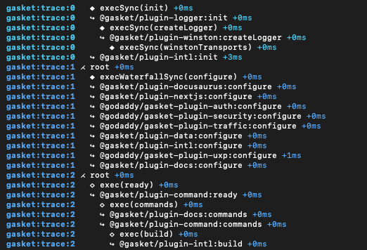

# @gasket/core

## Installation

#### Existing apps

```shell
npm install @gasket/core
```

Add a `gasket.js` file to the root of your project.
This can be a `.js` extension if your package.json has the `type` field set to `module`.
It is also possible to use with a `.ts` extension if you have TypeScript configured.

```js
// gasket.js
import { makeGasket } from '@gasket/core';
import LoggerPlugin from '@gasket/plugin-logger';
import MyPlugin from './my-plugin';

export default makeGasket({
  plugins: [
    LoggerPlugin,
    MyPlugin
  ]
});
```

You can now import the Gasket instance from your `gasket.js` file into your
application code.
With a Gasket, you can fire **actions** that will trigger **lifecycles** hooked
by plugins which encapsulate functionality allowing reuse across many applications.

### Registered plugins

A plugin is a module that exports a `name` and `hooks` object
(See [Plugins Guide]).
In your `gasket.js` file, you can import plugins and add them to the `plugins`
array of the Gasket configuration.

## Lifecycles

When a new Gasket is created, there are two lifecycles synchronous executed followed by two asynchronous lifecycles.

You can determine when the asynchronous lifecycles have completed by verifying that the `isReady` property on the Gasket instance has been resolved.

```js
import gasket from './gasket.js';
gasket.isReady.then(() => {
  gasket.actions.startServer();
});
```

The lifecycles are executed in the following order:

Synchronous lifecycles

1. [init]
2. [configure]

Asynchronous lifecycles

3. [prepare]
4. [ready]

### init

The `init` lifecycle allows the earliest entry to setting up a Gasket instance.
It can be used for setting up an initial state.

```js
// gasket-plugin-example.js

const name = 'gasket-plugin-example';

let _initializedTime;

const hooks = {
  init(gasket) {
    _initializedTime = Date.now();
  }
};

export default { name, hooks };
```

While it is possible to attach properties to the `gasket` instance, it is not
recommended.
Instead, a plugin can register [actions] that can be executed to retrieve
values the plugin wishes to make available.

### configure

The `configure` lifecycle is the first lifecycle executed when a Gasket is
instantiated.
This allows any [registered plugins] to adjust the configuration before further
lifecycles are executed.

```js
// gasket-plugin-example.js

const name = 'gasket-plugin-example';

const hooks = {
  configure(gasket, gasketConfig) {
    // Modify the configuration
    return {
      ...gasketConfig,
      example: true
    };
  }
};

export default { name, hooks };
```

In this example, we register an action `getDoodads` that will only execute if the
`example` configuration is set to `true`.
It will then execute the `doodads` lifecycle, allowing any registered plugin to
provide doodads.

### prepare

The `prepare` lifecycle is the first asynchronous lifecycle executed after the `configure` lifecycle. It is used to add any additional setup that requires asynchronous operations.

```js
// gasket-plugin-example.js

const name = 'gasket-plugin-example';

const hooks = {
  async prepare(gasket) {
    const asyncConfig = await getAsyncConfig();
    gasket.config = {
      ...gasket.config,
      ...asyncConfig
    };   
  }
};

export default { name, hooks };
```

### ready

The `ready` is the last lifecycle executed and is used to signal that
the Gasket instance is fully initialized and ready to be used.

After the `ready` lifecycle has been executed, the `isReady` property on the Gasket instance will be resolved signaling the last step of the Gasket instance initialization.

```js
// gasket-plugin-example.js

const name = 'gasket-plugin-example';

const hooks = {
  async ready(gasket) {
    console.log('Gasket is ready!');    
  }
};

export default { name, hooks };
```

## Actions

Plugins can register actions that can be fired by the application code
where the Gasket is imported, or in other plugins.

```js
// gasket-plugin-example.js

const name = 'gasket-plugin-example';

const actions = {
  async getDoodads(gasket) {
    if (gasket.config.example) {
      const dodaads = await gasket.exec('dodaads');
      return dodaads.flat()
    }
  }
};

export default { name, actions };
```

If a plugin needs to make properties available to other plugins, it should
register an action that can be executed to retrieve the value.

```diff
// gasket-plugin-example.js

const name = 'gasket-plugin-example';

+ let _initializedTime;

+ const actions = {
+   getInitializedTime() {
+     return _initializedTime;
+   }
+ };

const hooks = {
  init(gasket) {
-    gasket.initializedTime = Date.now();
+    _initializedTime = Date.now();
  },
  configure(gasket) {
-    const time = gasket.initializedTime;
+    const time = gasket.actions.getInitializedTime();
    // do something with time...
  }
};

- export default { name, hooks };
+ export default { name, actions, hooks };
```

## Debugging

Gasket makes use of the [debug] module to provide various debug outputs. Gasket
packages and plugins use the `gasket` namespace.

```shell
DEBUG=gasket:* npm run start
```

### Tracing

You can narrow down to see the action and lifecycle execution order in the
console output under the `gasket:trace` namespace.

```shell
DEBUG=gasket:trace* npm run start
```



The following symbols indicate the step and type of execution:

- `⋌` New Trace Branch
- `★` Action Start
- `◆` Synchronous Lifecycle Start
- `◇` Asynchronous Lifecycle Start
- `↪` Plugin lifecycle Hook

When ever the app or a plugin executes a lifecycle or an action, it will be
passed a traceable proxy object, which can be used to follow the execution
path of the application.
Any action or lifecycle that is executed from the root `gasket` object will
start a new trace "branch".
New branches can be created by calling `gasket.traceBranch()` to help debug
certain lifecycle flows.

Additionally, it is possible to start fresh traces by calling
`gasket.traceRoot()`.
This method should will exit the current branch's trace history
and start a fresh.
Use this sparingly only for situations such as tracing handling for new requests.

## Recursion Protection

Gasket uses the trace history to catch and prevent infinite recursion.
If a lifecycle is executed more than once in the same trace history,
it will throw an error and halt the execution.

While it is ok to execute the same action at various steps in an event chain,
you must avoid calling the same **lifecycle** from within itself.
Memoization can help avoid this issue, and using `req` as a key can help for
request-specific memoization, which is also a good performance optimization.

```js
// gasket-plugin-example.js

const reqMap = new WeakMap();

const name = 'gasket-plugin-example';
const actions = {
  async getDoodads(gasket, req) {
    if(!reqMap.has(req)) {
      const doodads = await gasket.exec('doodads', req);
      reqMap.set(req, doodads);
    }
    return reqMap.get(req);
  }
};
const hooks = {
  // ...
};

export default { name, actions, hooks };
```


[init]: #init 
[configure]: #configure
[prepare]: #prepare
[ready]: #ready 
[actions]: #actions 
[registered plugins]: #registered-plugins
[Plugins Guide]:/packages/gasket-cli/docs/plugins.md

[debug]:https://github.com/debug-js/debug
