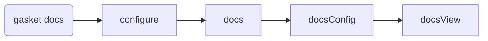

# `@gasket/docs-plugin`

The docs command is awesomeness

## Commands

### `docs`

Does the stuff

## Lifecycles

### `docs`

Add doc configuration per plugin.

### `docsConfig`

Allows adjustments of the overall docs config objects.

### `docsView`

Allows plugins to render the docs for the user.

By default this plugin with render docs using docsify.
If you are implementing a different plugin with a docsView hook, you can
disable docsify in your plugins `configure` hook.

```js
module.exports = {
  hooks: {
    configure( gasket, config ) {
      return {
        ...config,
        docs: {
          ...docs,
          docsify: false
        }
      }
    },
    async docsView( gasket, docsConfig ) {
      // do something
    }
  }
}
```

## Hooks

### `docsView`



