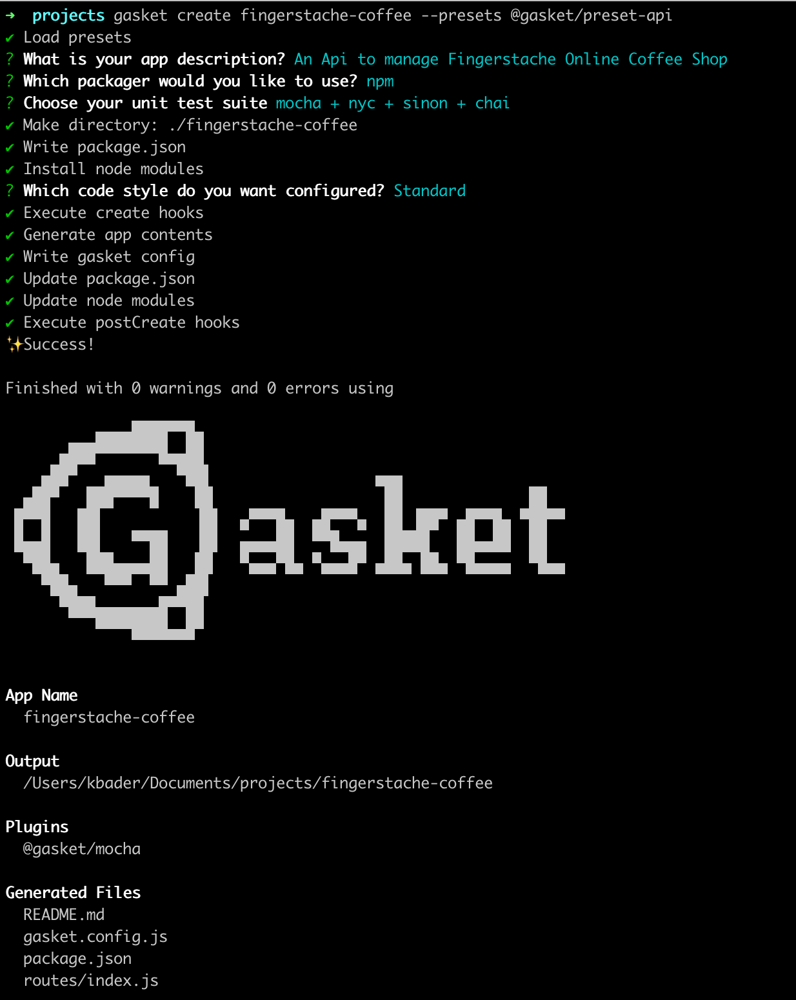

In this article, we'll learn how to create a simple API with Node.js and Express, using the Gasket API Preset. We'll also get a glimpse into generating API documentation with the new Gasket Swagger Plugin!

<!-- truncate -->

## Background

### What is Gasket?

Gasket is a framework maker, which creates the platform of patterns, integrations, and functionality that can be used to create JavaScript web applications and APIs. Along with scaffolding and application generation, Gasket also provides the essential elements for libraries and layers of apps to integrate together during runtime.

It is built on a plugin architecture that allows the users to include functionality through the installation of plugins.

Gasket also contains collections of plugins that are bundled together; these are referred to as `Presets`.

### What is the Gasket API Preset?

As we outlined above, a preset is a predefined collection of plugins that is useful when creating specific types of projects. The Gasket API Preset is a preset that is used to create an API.

This preset includes plugins to add Express to your application, enable http and https functionality, generate Swagger API documentation, and more.

The full list of plugins used in the Gasket API Preset can be found [here](https://github.com/godaddy/gasket/blob/master/packages/gasket-preset-api/package.json#L17-L26).

## Sample API Project

To demonstrate some of the functionality of this preset, let's create an API for the hot new online coffee shop, Fingerstache Coffee! We can use this API to return coffee orders for their amazing customers, located in Scranton, Pennsylvania!

### Setup

First, we need to ensure that Node.js and the Gasket CLI are installed.

```bash
node -v && gasket -v
```

Gasket requires Node.js version 8 or newer. Follow these instructions to install [Node.js](https://nodejs.org/en/download/) and/or [Gasket CLI](https://gasket.dev/#/packages/gasket-cli/README).

### Create A New API Project

Let's start by creating a new API project with the Gasket CLI. Run the following command in a terminal:

```bash
gasket create fingerstache-coffee --presets @gasket/preset-api
```

Here you can see that we are using the [create](https://gasket.dev/#/packages/gasket-cli/README?id=create-command) command to create our `fingerstache-coffee` project, and passing in the `@gasket/preset-api` as a [preset](https://gasket.dev/#/README?id=presets).

You will then be prompted to input a brief description of the API.


Next, choose which packager to use. We will choose `npm` for this project.


Lastly, we are prompted to choose which test suite we want to use. Let's choose `mocha + nyc + sinon + chai` for this project.


You will then be prompted to choose a code style, which will be reflected in the linting configuration. Let's choose `Standard`.


Gasket CLI will then execute a number of steps to start creating our API project.



Once complete, we will find our project under a newly created directory called `./fingerstache-coffee`. We can almost smell those coffee orders!

### Project Structure

Let's open our new API project in our favorite code editor. Navigate to the project folder using:
```bash
cd fingerstache-coffee
```

Here you will see the following structure:


#### package.json

Here we can see the `name` and `description` field were populated using the responses we provided in the previous steps.

```json
{
  "name": "fingerstache-coffee",
  "version": "0.0.0",
  "description": "An Api to manage Fingerstache Online Coffee Shop",
  "scripts": {
    "build": "gasket build",
    "start": "gasket start",
    "local": "gasket local",
    "test": "npm run test:runner",
    "test:runner": "mocha --require setup-env --recursive \"test/**/*.*(test|spec).js\"",
    "test:coverage": "nyc --reporter=text --reporter=json-summary npm run test:runner",
    "test:watch": "npm run test:runner -- --watch",
    "lint": "standard | snazzy",
    "lint:fix": "standard --fix | snazzy"
  },
  "dependencies": {
    "@gasket/cli": "^5.7.0",
    "@gasket/log": "^5.6.0",
    "@gasket/plugin-mocha": "^5.6.0",
    "@gasket/preset-api": "^5.9.0",
    "express": "^4.16.3"
  },
  "devDependencies": {
    "@babel/core": "^7.5.5",
    "@babel/register": "^7.0.0",
    "chai": "^4.2.0",
    "mocha": "^6.2.0",
    "nyc": "^14.1.1",
    "setup-env": "^1.2.2",
    "sinon": "^7.4.1",
    "snazzy": "^8.0.0",
    "standard": "^15.0.0"
  },
  "standard": {
    "env": [
      "mocha"
    ],
    "ignore": [
      "build/"
    ]
  }
}
```

Next, you'll see a handful of script commands. You can learn more about these gasket commands [here](https://gasket.dev/#/README?id=commands). The `test` and `lint` related commands were generated by Gasket CLI, based off of our selected test suite.

Lastly, you will see a list of our dependencies, dev dependencies and additional eslint config properties. One thing to point out here is the inclusion of the `@gasket/preset-api` dependency.

#### gasket.config.js

In the `gasket.config.js`, we will find 3 main properties:

1. The plugins properties with the `@gasket/api` preset field and the `@gasket/mocha` plugin
2. The express property, which outlines the location of the api routes
3. The Swagger properties, detailing the title, version, and location of Swagger docs

```javascript
module.exports = {
  plugins: {
    presets: [
      '@gasket/api'
    ],
    add: [
      '@gasket/mocha'
    ]
  },
  express: {
    routes: './routes/*'
  },
  swagger: {
    jsdoc: {
      definition: {
        info: {
          title: 'fingerstache-coffee',
          version: '1.0.0'
        }
      },
      apis: [
        './routes/*'
      ]
    }
  }
}
```

#### /routes Directory

We will also find a directory at the root of our project called `/routes`. This folder contains our route definitions. We can see a file inside of this directory called `index.js`. This file contains a default route that has been automatically documented with Swagger documentation syntax.

```javascript
module.exports = (app) => {
  /**
   * @swagger
   *
   * /default:
   *   get:
   *     summary: "Get default route"
   *     produces:
   *       - "application/json"
   *     responses:
   *       "200":
   *         description: "Returns welcome message."
   *         content:
   *           application/json
   */
  app.get('/default', async (req, res, next) => {
    res.status(200).json({
      message: 'Welcome to your default route...'
    })
  })
}
```

Here we can see a route using the `GET` method that will return a `200` status code with a JSON object containing a welcome message.

Additional routes can be added to this `index.js` file, or we can create more route files inside of the `/routes` folder.

We will discuss the block of `@swagger` comments above the route a bit later.

### Add A Route

Let's add a new route to the `index.js` file. Paste the following code after the existing `/default` route:

```javascript
app.get('/orders', async (req, res, next) => {
  // Log message to server's console
  console.log(`Coffee orders requested at ${Date.now()}`)
  // Return success HTTP response code and return coffee orders
  res.status(200).json({
    orders: [
      {
        customer: 'Michael Scott',
        coffee: 'Deja Brew Cold Brew'
      },
      {
        customer: 'Stanley Hudson',
        coffee: 'Espresso Tonic'
      },
      {
        customer: 'Creed Bratton',
        coffee: 'Pumpkin Spice Latte'
      }
    ]
  })
})
```

Here we are defining a route using the `GET` method. This route will log a message to the console of our API. It will then return a `200` status code with a JSON object. The JSON object will contain details of our customers and their orders.

### Starting Up The API

To start the API, run `npm run local` from the root of the `./fingerstache-coffee` directory (you may need to navigate to the project root directory, before running):
```bash
cd fingerstache-coffee
```

Once the API is running, navigate to http://localhost:8080/default in a browser to see the default welcome message:

```json
{
  "message": "Welcome to your default route..."
}
```

Next, navigate to http://localhost:8080/orders, and we see the orders response object.


Look at that! We just created our first API endpoint that returns coffee orders for our customers from Dunder Mifflin Paper Company, Inc!

### Swagger Docs

We've made great progress so far, but in order for our API to be easier to use by front-end applications, or other services, we want to add a bit of documentation.

The Gasket API Preset includes the `@gasket/plugin-swagger`. This plugin provides the ability to generate Swagger documentation for an API, and uses `swagger-ui-express` to serve the Swagger UI docs.

The Swagger documentation will be generated/updated every time the project is built. By default, the Swagger page for an API is `/api-docs`. This can be changed in the `gasket.config.js`.

At this point if we run our API `npm run local` and navigate to `http://localhost:8080/api-docs/`, we will find
the Swagger page containing information for the `/default` route only.


This is because we have not added any documentation for our new route. Let's do that next!

### Route Documentation

Navigate to the `index.js` file and paste the following above the `/orders` route definition:

```javascript
/**
 * @swagger
 *
 * /orders:
 *   get:
 *     summary: "Get current coffee orders"
 *     produces:
 *       - "application/json"
 *     responses:
 *       "200":
 *         description: "An array of orders"
 *         content:
 *           application/json
 *         schema:
 *           type: "array"
 *           items:
 *             $ref: "#/definitions/Order"
 * definitions:
 *   Order:
 *     type: "object"
 *     properties:
 *       customer:
 *         type: "string"
 *       coffee:
 *         type: "string"
 */
```

Our `index.js` file should now look like this:

```javascript
module.exports = (app) => {
  /**
   * @swagger
   *
   * /default:
   *   get:
   *     summary: "Get default route"
   *     produces:
   *       - "application/json"
   *     responses:
   *       "200":
   *         description: "Returns welcome message."
   *         content:
   *           application/json
   */
  app.get('/default', async (req, res, next) => {
    res.status(200).json({
      message: 'Welcome to your default route...'
    });
  });

  /**
   * @swagger
   *
   * /orders:
   *   get:
   *     summary: "Get current coffee orders"
   *     produces:
   *       - "application/json"
   *     responses:
   *       "200":
   *         description: "An array of orders"
   *         content:
   *           application/json
   *         schema:
   *           type: "array"
   *           items:
   *             $ref: "#/definitions/Order"
   * definitions:
   *   Order:
   *     type: "object"
   *     properties:
   *       customer:
   *         type: "string"
   *       coffee:
   *         type: "string"
   */
  app.get('/orders', async (req, res, next) => {
    // Log message to server's console
    console.log(`Coffee orders requested at ${Date.now()}`);
    // Return success HTTP response code and return coffee orders
    res.status(200).json({
      orders: [
        {
          customer: 'Michael Scott',
          coffee: 'Deja Brew Cold Brew'
        },
        {
          customer: 'Stanley Hudson',
          coffee: 'Espresso Tonic'
        },
        {
          customer: 'Creed Bratton',
          coffee: 'Pumpkin Spice Latte'
        }
      ]
    });
  });
};
```

Here we have documented the route using a JSDoc-style format that the swagger-jsdoc module can parse and render. More information on the various doc parameters can be found on the [swagger-jsdoc github](https://github.com/Surnet/swagger-jsdoc/blob/master/docs/GETTING-STARTED.md).

Now if we stop and restart the API
```bash
control+c
npm run local
```
and navigate to the `/api-docs` page, we see our `/orders` endpoint documentation:


## Conclusion

As you can see, the process of creating an API is much faster and easier, with the help of the Gasket API Preset. Out of the box, we can ensure that our API is documented with a generated API Swagger docs page. This will help to support ease of use for other applications and services.

Now let's get these coffee orders brewed!

Additional Resources:

- [Gasket](https://gasket.dev/#/README)
- [@gasket/preset-api](https://github.com/godaddy/gasket/blob/master/packages/gasket-preset-api/README.md)
- [@gasket/plugin-swagger](https://github.com/godaddy/gasket/tree/master/packages/gasket-plugin-swagger/README.md)
